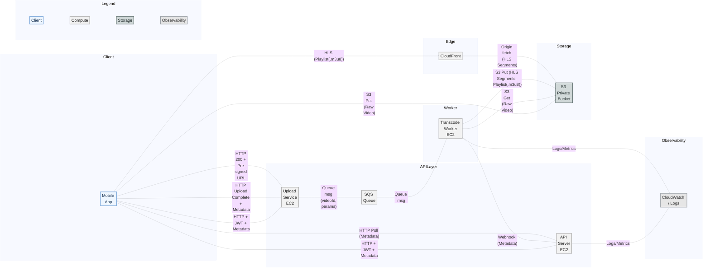

# Problem Statement and Constraints

## Problem Statement

- We need to build a complete pipeline for large video upload + transcoding + HLS playback in a mobile app.

## Constraints and Goals

- Only allow these video formats: `MOV / MP4 / 3GP / AVI / WMV`
- Maximum file size is <= 1.5GB (validate on both client and server) to avoid oversized uploads that waste bandwidth, storage, and processing capacity
- Store raw videos and transcoded outputs in a private AWS S3 bucket, with a time-based lifecycle policy to archive long-unaccessed assets to Amazon S3 Glacier for cost control and recoverability
- Playback must be served through AWS CloudFront; clients must not access S3 directly
- The system must maintain queryable lifecycle states: `DRAFT / UPLOADING / UPLOADED / TRANSCODING / READY / FAILED`
- Only when status is `READY` may the API return the CloudFront `master.m3u8` URL; all other states must not return a playable URL

---

# User Story

As an Agent (mobile real estate agent),
I want to upload a large video and later play it smoothly via adaptive bitrate,
so that viewers can reliably watch property tour content even on poor networks and always see clear processing status.

---

# Architecture Decisions

## Architecture Summary (Deployment and Data Flow)



---

## 1. Database Design

### Design Goals (Problems Solved)

- Manage the core video record and lifecycle
- Organize multi-quality outputs and derived assets
- Provide reliable large-file upload and resume support
- Give the frontend a single source of truth for status

---

### 1.1 Raw Video Table (videos)

| Field             | Type        | Description                                                 |
| ----------------- | ----------- | ----------------------------------------------------------- |
| id                | uuid (PK)   | Video ID                                                    |
| owner_id          | uuid        | Uploading user / agent                                      |
| title             | text        | Video title                                                 |
| description       | text        | Video description                                           |
| source_file_key   | text        | Object key of the original file in S3                       |
| source_size_bytes | bigint      | Original file size                                          |
| source_mime       | text        | MIME type (e.g., video/mp4)                                 |
| duration_seconds  | numeric     | Duration in seconds                                         |
| width             | int         | Video width                                                 |
| height            | int         | Video height                                                |
| status            | enum        | DRAFT / UPLOADING / UPLOADED / TRANSCODING / READY / FAILED |
| fail_reason       | text        | Failure reason                                              |
| created_at        | timestamptz | Created time                                                |
| updated_at        | timestamptz | Updated time                                                |

---

### 1.2 HLS Asset Table (video_assets)

| Field         | Type        | Description                            |
| ------------- | ----------- | -------------------------------------- |
| id            | uuid (PK)   | Primary key                            |
| video_id      | uuid (FK)   | Video ID                               |
| type          | enum        | HLS_MASTER / HLS_RENDITION / THUMBNAIL |
| quality_label | text        | 1080p / 720p / 480p                    |
| bandwidth     | int         | HLS bandwidth                          |
| width         | int         | Video width                            |
| height        | int         | Video height                           |
| codec         | text        | Codec (h264 / aac)                     |
| container     | text        | m3u8 / ts                              |
| file_key      | text        | Object key in S3                       |
| created_at    | timestamptz | Created time                           |

---

### 1.3 Upload Sessions Table (upload_sessions)

| Field              | Type        | Description                                                      |
| ------------------ | ----------- | ---------------------------------------------------------------- |
| id                 | uuid (PK)   | Upload session ID                                                |
| video_id           | uuid (FK)   | Video ID                                                         |
| provider           | enum        | S3_MULTIPART / TUS                                               |
| provider_upload_id | text        | Provider uploadId                                                |
| status             | enum        | INITIATED / IN_PROGRESS / PAUSED / COMPLETED / FAILED / CANCELED |
| bytes_uploaded     | bigint      | Uploaded bytes                                                   |
| created_at         | timestamptz | Created time                                                     |

> Row-level locking can be enabled to prevent concurrent part uploads from corrupting status or progress.

---

### 1.4 Pros and Cons

#### Overall Design (videos / video_assets / upload_sessions)

- Pros: core records and derived assets are decoupled; supports multi-quality HLS; `videos` is a single status source; `upload_sessions` enables resume and concurrency; easy to extend for new renditions.
- Cons: multi-table joins increase complexity; async transcoding + object storage increases consistency risk; enums are less flexible; more tables and indexes to maintain.

#### videos Table

- Pros: lifecycle centralized; easy for state machine, caching, and access control.
- Cons: async errors can leave state inconsistent with stored assets; high-frequency progress updates do not belong in the main table.

#### video_assets Table

- Pros: explicit one-to-many mapping; easy to query by quality/codec.
- Cons: needs uniqueness/type constraints to avoid duplicate assets; may be over-normalized for small scale.

#### upload_sessions Table

- Pros: reliable large uploads; resume/retry support; provider upload ID for recovery.
- Cons: frequent updates; lock contention; needs cleanup for expired sessions.

**One-line summary**: this design uses `videos` as the single status source, `video_assets` for multi-quality outputs, and `upload_sessions` for reliable uploads; it is extensible and traceable but adds join and consistency overhead that must be managed with indexes, constraints, and async compensation.

---

### 1.5 State Machine Details

#### videos.status

| From        | To          | Trigger                                         |
| ----------- | ----------- | ----------------------------------------------- |
| DRAFT       | UPLOADING   | Create upload session or start first part       |
| UPLOADING   | UPLOADED    | Upload finished, size/etag validated            |
| UPLOADED    | TRANSCODING | Transcode job enqueued                          |
| TRANSCODING | READY       | Transcode webhook success, `video_assets` saved |
| TRANSCODING | FAILED      | Transcode failed or retries exceeded            |
| UPLOADING   | FAILED      | Upload failed or canceled (optional)            |
| FAILED      | TRANSCODING | Manual/system retry (source file exists)        |

**Forbidden / Constraints**:

- `READY` must not roll back
- Entering `TRANSCODING` requires a valid source file
- Entering `READY` requires `video_assets`

#### upload_sessions.status

| From        | To          | Trigger                                |
| ----------- | ----------- | -------------------------------------- |
| INITIATED   | IN_PROGRESS | Start uploading first part             |
| IN_PROGRESS | PAUSED      | User taps Pause                        |
| PAUSED      | IN_PROGRESS | User taps Resume                       |
| IN_PROGRESS | COMPLETED   | All parts uploaded and complete called |
| IN_PROGRESS | FAILED      | Retry failure or provider error        |
| IN_PROGRESS | CANCELED    | User cancels                           |
| PAUSED      | CANCELED    | Cancel while paused                    |

**Forbidden / Constraints**:

- `COMPLETED` / `CANCELED` must not resume
- `FAILED` should create a new session rather than continue

---

## 2. API Design

### 2.0 Overall Design Pros/Cons (Table)

| Dimension     | Pros                                                  | Cons / Risks                                                    |
| ------------- | ----------------------------------------------------- | --------------------------------------------------------------- |
| Resource CRUD | Clear paths; low learning cost; easy to extend fields | Long-running flows still need extra endpoints                   |
| Status-driven | `status` as a single UI signal                        | Status may lag actual assets; eventual consistency required     |
| Polling       | Simple to implement client-side                       | High frequency polling adds load; scale needs push or callbacks |
| Cursor paging | Stable performance and filtering                      | No random access; requires stable sort + indexes                |
| PATCH updates | Minimal updates, fewer conflicts                      | Needs versioning/ETag to avoid overwrites                       |

### 2.1 Video CRUD

#### Create Video

**POST /api/videos**

**Request Body**

```json
{
  "title": "Property Tour - 12 Smith St",
  "description": "Short tour",
  "sourceMime": "video/mp4",
  "sourceSizeBytes": 734003200
}
```

**Response Body**

```json
{
  "id": "video_uuid",
  "ownerId": "user_uuid",
  "title": "Property Tour - 12 Smith St",
  "description": "Short tour",
  "source": {
    "mime": "video/mp4",
    "sizeBytes": 734003200
  },
  "status": "DRAFT",
  "createdAt": "2026-01-22T03:00:00Z",
  "updatedAt": "2026-01-22T03:00:00Z"
}
```

---

#### Get Video

**GET /api/videos/{videoId}**

**Response Body (TRANSCODING)**

```json
{
  "id": "video_uuid",
  "ownerId": "user_uuid",
  "title": "Property Tour - 12 Smith St",
  "description": "Short tour",
  "status": "TRANSCODING",
  "failReason": null,
  "playback": {
    "ready": false,
    "streamUrl": null
  },
  "createdAt": "2026-01-22T03:00:00Z",
  "updatedAt": "2026-01-22T03:05:00Z"
}
```

**Response Body (READY)**

```json
{
  "id": "video_uuid",
  "status": "READY",
  "playback": {
    "ready": true,
    "streamUrl": "https://cdn.example.com/videos/video_uuid/hls/master.m3u8"
  }
}
```

---

#### List Videos

**GET /api/videos**

**Query Parameters**

- `limit` (optional): default 20
- `cursor` (optional): cursor pagination
- `status` (optional): filter by status (DRAFT / UPLOADING / TRANSCODING / READY / FAILED)

Example:

```
GET /api/videos?limit=20&status=READY
```

**Response Body**

```json
{
  "items": [
    {
      "id": "video_uuid_1",
      "title": "Property Tour - 12 Smith St",
      "description": "Short tour",
      "status": "READY",
      "createdAt": "2026-01-22T03:00:00Z",
      "updatedAt": "2026-01-22T03:10:00Z"
    }
  ],
  "nextCursor": "eyJjcmVhdGVkQXQiOiIyMDI2LTAxLTIyVDAyOjQwOjAwWiIsImlkIjoidmlkZW9fdXVpZF8yIn0="
}
```

---

#### Update Video Metadata

**PATCH /api/videos/{videoId}**

**Request Body**

```json
{
  "title": "Updated title",
  "description": "Updated description"
}
```

**Response Body**

```json
{
  "id": "video_uuid",
  "title": "Updated title",
  "description": "Updated description",
  "status": "READY",
  "updatedAt": "2026-01-22T03:10:00Z"
}
```

---

#### Delete Video

**DELETE /api/videos/{videoId}**

**Response**

```
204 No Content
```

---

### 2.2 Upload Session (Multipart Upload)

#### Create Upload Session

**POST /api/videos/{videoId}/uploads**

**Request Body**

```json
{
  "sourceMime": "video/mp4",
  "sourceSizeBytes": 734003200
}
```

**Response Body**

```json
{
  "uploadSessionId": "upload_uuid",
  "partSizeBytes": 5242880,
  "status": "INITIATED"
}
```

---

#### Get Upload Session

**GET /api/uploads/{uploadSessionId}**

**Response Body**

```json
{
  "uploadSessionId": "upload_uuid",
  "status": "IN_PROGRESS",
  "bytesUploaded": 15728640,
  "partSizeBytes": 5242880
}
```

---

#### Get Part Upload URL

**POST /api/uploads/{uploadSessionId}/parts**

**Request Body**

```json
{
  "partNumber": 3
}
```

**Response Body**

```json
{
  "partNumber": 3,
  "uploadUrl": "https://s3.example.com/...",
  "expiresAt": "2026-01-22T03:10:00Z"
}
```

---

#### Complete Upload

**POST /api/uploads/{uploadSessionId}/complete**

**Request Body**

```json
{
  "parts": [
    { "partNumber": 1, "etag": "etag-1" },
    { "partNumber": 2, "etag": "etag-2" }
  ]
}
```

**Response Body**

```json
{
  "uploadSessionId": "upload_uuid",
  "status": "COMPLETED"
}
```

---

#### Pause Upload

**POST /api/uploads/{uploadSessionId}/pause**

**Response Body**

```json
{
  "uploadSessionId": "upload_uuid",
  "status": "PAUSED"
}
```

---

#### Resume Upload

**POST /api/uploads/{uploadSessionId}/resume**

**Response Body**

```json
{
  "uploadSessionId": "upload_uuid",
  "status": "IN_PROGRESS"
}
```

---

#### Cancel Upload

**POST /api/uploads/{uploadSessionId}/cancel**

**Response Body**

```json
{
  "uploadSessionId": "upload_uuid",
  "status": "CANCELED"
}
```

---

### 2.3 Webhooks

#### Upload Completed Webhook

**POST /api/webhooks/uploads**

**Request Body**

```json
{
  "uploadSessionId": "upload_uuid",
  "videoId": "video_uuid",
  "status": "COMPLETED",
  "sourceFileKey": "videos/video_uuid/source.mp4",
  "sourceSizeBytes": 734003200,
  "sourceMime": "video/mp4"
}
```

**Response**

```
204 No Content
```

---

#### Transcoding Job Webhook

**POST /api/webhooks/transcoding**

**Request Body (READY)**

```json
{
  "videoId": "video_uuid",
  "status": "READY",
  "durationSeconds": 62.5,
  "width": 1920,
  "height": 1080,
  "assets": [
    {
      "type": "HLS_MASTER",
      "fileKey": "videos/video_uuid/hls/master.m3u8"
    },
    {
      "type": "HLS_RENDITION",
      "quality": "1080p",
      "bandwidth": 5000000,
      "fileKey": "videos/video_uuid/hls/1080p/playlist.m3u8"
    }
  ]
}
```

**Request Body (FAILED)**

```json
{
  "videoId": "video_uuid",
  "status": "FAILED",
  "failReason": "TRANSCODE_ERROR"
}
```

**Response**

```
204 No Content
```

---

## 3. Frontend Architecture

### 3.1 Upload State

#### 3.1.1 Background Tasks

**Problem**:
Unstable connections and low bandwidth make large uploads unreliable.

**Solution**:
Use multipart upload.

**Implementation**:

- Backend:

  - Provide `uploadSessionId`
  - Provide `partSizeBytes`
  - Return pre-signed URLs by `partNumber`

- Frontend:
  - Compute file size and number of parts
  - Upload parts sequentially via PUT to S3
  - Record each successful `partNumber`
  - Retry only the failed part (exponential backoff)
  - Call `/upload/complete` after all parts succeed

**Benefits**:

- Upload progress is measurable (completed parts / total parts)
- Supports resumable uploads

---

#### 3.1.2 Progress Bar

**Problem**:
Users need visual progress and controls (pause/resume/cancel) for long uploads.

**Solution**:
Aggregate progress by parts:

```
progress = (sum(successfulPartsBytes) + currentPartUploadedBytes) / totalBytes
```

**UI Behavior**:

- Uploading: progress bar + percentage + uploaded / total size
- Status text: UPLOADING / RETRYING / PAUSED / FAILED
- Action buttons: Pause / Resume / Cancel

**Benefits**:

- Clear visibility into progress
- User control over the process
- Stable UX in poor networks

### 3.2 Video Player

#### 3.2.1 HLS in React Native

**Problem**:
Mobile networks are unstable; a single MP4 stream stalls often. We also need multi-quality playback with adaptive bitrate.

**Solution**:

1. Use HLS (`.m3u8`) as the playback protocol

   - The client loads only `master.m3u8`
   - The player adapts quality automatically (ABR)

2. React Native library: `react-native-video`
   - iOS: **AVPlayer**
   - Android: **ExoPlayer**
   - Pass `master.m3u8` as `source.uri`

---

**UI Behavior**:

- Video status is `READY`

  - Show the player
  - Provide Play / Pause
  - Allow quality selection (Auto / 1080p / 720p / 480p)

- Video status is `TRANSCODING`

  - Show poster image
  - Text: "Video processing"
  - Disable play button

- Playing

  - Show "Loading..." while buffering

- Playback failure
  - Show error message
  - Provide retry action

---

**Cache Strategy**:

1. **Primary cache: CDN (CloudFront) for HLS segments**

   - Objects:
     - `master.m3u8`
     - rendition playlists
     - segments (`.ts` / `.m4s`)
   - Goals:
     - Reduce time-to-first-frame
     - Improve playback stability on weak networks

2. **On-device strategy: buffer only, no heavy offline cache**

   - Reduce rebuffering via player buffer configuration

     ```tsx
     // iOS example
     <Video
       source={{ uri: "https://cdn.example.com/master.m3u8" }}
       paused={false}
       automaticallyWaitsToMinimizeStalling={true}
       preferredForwardBufferDuration={30} // iOS: target 30s forward buffer
       preferredPeakBitRate={1_500_000} // iOS: cap peak bitrate at 1.5Mbps
     />
     ```

   - Do not persist cache files to avoid complex storage management

---

**Pros**:

- HLS ABR significantly reduces stalling on poor networks
- Native player decoding is stable and hardware-accelerated
- CDN caching reduces origin load and improves global access
- Buffer tuning is simple and low-risk

---

**Cons**:

- More complex than direct MP4 (transcoding + multi-quality assets)
- Misconfigured CDN caching can delay playlist updates
- Offline caching for HLS is costly to implement

---

#### UX: Video in Transcoding State (3.2.2)

**Problem**:
Transcoding is asynchronous and time-consuming. Without clear feedback, users may think the app is stuck or the upload failed.

---

**Solution**:
When status is `TRANSCODING`, clearly show a "processing" state and avoid playback attempts.

---

**UI Behavior**:

- **Poster display**

  - Show poster image (if available) or a placeholder
  - Keep the page visually complete

- **Status copy**

  - Primary: `Video processing` / `Generating playable version`
  - Secondary: `This may take a few minutes`

- **Progress indicator (optional)**

  - If backend provides progress:
    - Show indeterminate bar or percentage
  - If not:
    - Show loading spinner to avoid fake progress

- **Playback control**

  - Disable play button
  - On tap: `Video is still processing`

- **User guidance**
  - Suggest returning to the list and checking later
  - Support pull-to-refresh or auto polling

---

**Polling Strategy**:

- Client polls `GET /api/videos/{id}`
- Backend updates status on transcoding webhook; client can use polling or push (WebSocket / SSE)
- When status moves `TRANSCODING` -> `READY`:
  - Refresh UI
  - Enable play
  - Show playback entry

---

**Benefits**:

- Users understand what is happening
- Reduces duplicate uploads or mis-operations
- Sets expectations for unpredictable processing time
- UI stays consistent with backend lifecycle

---

**Cons / Tradeoffs**:

- Users still wait for long transcodes
- Without exact progress, only spinners can be shown
- Requires shared status model and polling/push strategy

---

## 4. Streaming Strategy (Bitrate Part): End-to-End `.mp4` -> `.m3u8`

**Problem**:
Mobile-recorded `.mp4` files are single-bitrate; they stall on weak networks. We need HLS to enable adaptive bitrate and stable playback.

---

### 4.1 Flow: `.mp4` -> `.m3u8`

1. **Record / select video on device**

   - User creates `source.mp4`

2. **Upload to object storage (S3)**

   - Client uses multipart / resumable upload
   - After completion, backend sets status to `UPLOADED`

3. **Enqueue transcoding job**

   - API Server:
     - Writes video record (DB)
     - Enqueues job (queue)
     - Updates status to `TRANSCODING`

4. **Worker transcodes (FFmpeg)**

   - Worker:
     - Reads `source.mp4` from S3
     - Generates HLS outputs (multi-quality + master playlist)

5. **Upload HLS outputs to S3**

   - Outputs:
     - `master.m3u8`
     - rendition playlists: `1080p/playlist.m3u8`, `720p/playlist.m3u8`, ...
     - segments: `.ts` / `.m4s`

6. **Worker writes back status and assets**

   - Worker updates DB or calls webhook:
     - Write `video_assets`
     - Update `videos.status = READY`

7. **Client polls / subscribes**

   - Client calls `GET /api/videos/{id}`
   - On `READY`, receives:
     - `streamUrl = https://cdn.xxx/videos/{id}/master.m3u8`

8. **Playback**
   - React Native player loads `master.m3u8`
   - ABR selects bitrate automatically
   - User sees stable playback

---

### 4.2 Where Transcoding Runs: API Server or Worker?

**Choice**: Background Worker (not API Server)

**Reasons**:

- Transcoding is CPU/IO heavy and long-running (minutes)
- Running on API Server:
  - Blocks request threads / event loop
  - Couples API and transcode scaling
  - Increases timeouts and instability

**Worker Pros**:

- API handles only lightweight requests
- Worker scales independently with queue pressure
- Easier retries, isolation, and resource limits

**Cons / Tradeoffs**:

- More complex architecture (queue, workers)
- Must handle idempotency and duplicate jobs

---

### 4.2.1 Transcode Worker and Queue

**Purpose**: Decouple transcoding from API requests, enabling asynchronous processing, backpressure, and retries.

**Flow**:

- **Enqueue time**: after upload completes, API sets `video` to `UPLOADED` and pushes a job
- **Payload**: `videoId`, `sourceFileKey`, target qualities, transcode params
- **Worker behavior**: pull job -> transcode -> write `video_assets`
- **Status writeback**: success -> `videos.status = READY`; failure -> `FAILED` with reason
- **Retry strategy**: exponential backoff, then manual review

**Possible implementations**:

- SQS / RabbitMQ

---

### 4.3 File Storage: Where do videos live? (CDN / S3)

**Layered storage (recommended)**:

#### 4.3.1 Source Files

- Location: **S3 (private bucket)**
- Content: `source.mp4`
- Purpose: keep originals for re-transcode or audit

#### 4.3.2 HLS Outputs (Playback Assets)

- Location: **S3 (private bucket)**
- Content:
  - `master.m3u8`
  - `renditions/*.m3u8`
  - `segments/*.ts` / `.m4s`

#### 4.3.3 Delivery Layer

- Distribution: **CloudFront CDN**
- Frontend access: CloudFront URLs only (no direct S3 access)
- Purpose:
  - Edge caching for low latency
  - Reduce origin load and improve stability

---

**Pros**:

- S3 provides durable storage
- CloudFront provides performant distribution
- HLS enables adaptive bitrate for weak networks

**Cons / Tradeoffs**:

- Extra transcoding and storage cost
- CDN caching must be configured carefully (playlist TTL)

---

# Component Logic

## System-level Component Responsibility Table

| Component        | Primary Responsibilities                                  | Inputs                             | Outputs                                        | Notes                                  |
| ---------------- | --------------------------------------------------------- | ---------------------------------- | ---------------------------------------------- | -------------------------------------- |
| Mobile App       | Capture/select video, start upload, poll status, play HLS | User file, auth                    | Multipart upload requests, playback requests   | Consumes `videos.status` only          |
| API Server       | Business entry point and status management                | Client requests, webhook callbacks | Video records, upload sessions, status updates | `videos.status` is the source of truth |
| Upload Service   | Manage upload sessions and part signing                   | Video metadata, uploadSessionId    | Pre-signed URLs, session state                 | Handles upload idempotency and retries |
| Transcode Worker | Pull jobs and transcode                                   | Queue messages, source file        | HLS outputs, webhook callbacks                 | Queue consumer                         |
| Storage (S3)     | Store raw and HLS assets                                  | Raw video, HLS segments            | Persisted objects, lifecycle management        | Durable storage                        |
| CDN (CloudFront) | Cache and deliver HLS                                     | HLS outputs                        | Cached segments and playback path              | Only CDN access allowed                |
| Webhook          | Receive transcode callbacks                               | Worker callback                    | Status update trigger                          | API Server callback entry              |

**Role notes**:

- **Source of truth**: `videos.status` is owned by API Server
- **Queue producer / consumer**: API Server is producer; Transcode Worker is consumer

## Boundary Conditions

- **Retries**: upload and transcode use exponential backoff; failures exceed threshold -> `FAILED`
- **Idempotency**: repeated transcode messages for the same `videoId` are ignored if `READY`
- **No rollback**: `READY` must not roll back; `COMPLETED/CANCELED` must not resume

## Subcomponent Breakdown

| Component  | Subcomponent      | Responsibility                                           |
| ---------- | ----------------- | -------------------------------------------------------- |
| Mobile App | Upload Manager    | Multipart upload, resume, retries                        |
| Mobile App | Video List        | Show list and card status (READY / TRANSCODING / FAILED) |
| Mobile App | Player            | HLS playback and ABR                                     |
| Mobile App | Cache             | Buffer control and short-term caching                    |
| API Server | Video Service     | Status transitions and queries                           |
| API Server | Upload Controller | Session creation and part signing                        |
| API Server | Webhook Handler   | Handle transcode callbacks and write `video_assets`      |
| Worker     | Transcode Runner  | Run FFmpeg and generate renditions                       |
| Worker     | Asset Writer      | Upload assets and write metadata                         |

---

# Directory Structure (Frontend/Backend Split)

## Backend Repo (FastAPI + PostgreSQL + S3 + Worker)

```text
backend/
├─ app/
│  ├─ main.py                     # FastAPI entry
│  ├─ core/
│  │  ├─ settings.py              # Configuration
│  │  └─ security.py              # JWT / auth
│  ├─ db/
│  │  ├─ base.py                  # Base / Session
│  │  └─ session.py
│  ├─ models/
│  │  ├─ video.py                 # videos table
│  │  ├─ video_asset.py           # video_assets table
│  │  └─ upload_session.py        # upload_sessions table
│  ├─ schemas/
│  │  ├─ video.py
│  │  ├─ upload.py
│  │  └─ webhook.py
│  ├─ routers/
│  │  ├─ videos.py                # /api/videos
│  │  ├─ uploads.py               # /api/uploads
│  │  └─ webhooks.py              # /api/webhooks
│  ├─ services/
│  │  ├─ video_service.py         # Status transitions and queries
│  │  ├─ upload_service.py        # Multipart signing / sessions
│  │  ├─ webhook_service.py       # Callback handling
│  │  └─ s3_service.py            # S3 read/write
│  └─ utils/
│     ├─ idempotency.py
│     └─ validators.py
├─ worker/
│  ├─ main.py                     # Worker entry
│  ├─ tasks/
│  │  └─ transcode.py             # FFmpeg/HLS transcode
│  ├─ services/
│  │  ├─ ffmpeg_service.py
│  │  └─ asset_writer.py
│  └─ utils/
│     └─ s3_client.py
├─ migrations/                    # Alembic
├─ tests/
├─ infra/
│  ├─ terraform/                  # S3 / CloudFront / SQS / EC2
│  └─ compose/                    # Local dev
├─ requirements.txt
└─ README.md
```

## Frontend Repo (React Native)

```text
frontend/
├─ android/                        # React Native Android project
├─ ios/                            # React Native iOS project
├─ App.tsx                         # RN entry component
├─ index.js                        # RN entry file
├─ src/
│  ├─ screens/
│  │  └─ VideoScreen.tsx          # Single-page entry
│  ├─ components/
│  │  ├─ VideoList/
│  │  │  ├─ VideoList.tsx         # List and status
│  │  │  ├─ index.ts              # export VideoList
│  │  │  └─ components/
│  │  │     ├─ VideoCard.tsx
│  │  │     └─ index.ts           # export VideoCard
│  │  ├─ VideoDetail/
│  │  │  ├─ VideoDetail.tsx       # Playback and status
│  │  │  ├─ index.ts              # export VideoDetail
│  │  │  └─ components/
│  │  │     ├─ PlayerView.tsx
│  │  │     └─ index.ts           # export PlayerView
│  │  └─ UploadPanel/
│  │     ├─ UploadPanel.tsx       # Upload entry
│  │     ├─ index.ts              # export UploadPanel
│  │     └─ components/
│  │        ├─ UploadProgressBar.tsx
│  │        └─ index.ts           # export UploadProgressBar
│  ├─ services/
│  │  ├─ apiClient.ts             # API client
│  │  ├─ uploadManager.ts         # Multipart upload / resume
│  │  └─ playbackService.ts       # HLS playback config
│  ├─ hooks/
│  │  └─ useVideoStatus.ts
│  └─ utils/
│     ├─ fileValidator.ts
│     └─ format.ts
├─ app.json
├─ babel.config.js
├─ package.json
├─ tsconfig.json
└─ README.md
```

---

# Acceptance Criteria

## Scenario 1: Successful Upload and Playback

- **Given**: file format in {MOV, MP4, 3GP, AVI, WMV}, and file size <= 1.5GB
- **When**: the user creates a video record and uploads via multipart/resumable to S3
- **Then**:
  - `POST /api/videos` stores the raw video in S3
  - a backend transcode job is triggered to produce HLS
  - video status eventually becomes `READY`
  - `GET /api/videos/{id}` returns the CloudFront `master.m3u8` URL

## Scenario 2: Validation Failure

- **Given**: the file format is not in {MOV, MP4, 3GP, AVI, WMV} or the file size is > 1.5GB
- **When**: the client attempts to create a video or initiate upload
- **Then**:
  - the client blocks the upload before start
  - the backend performs the same validation on create/init
  - the API returns a structured error response

## Scenario 3: Transcoding Failure / Network Interruption

- **Given**: a transcode fails or the upload connection is interrupted
- **When**: the worker reports failure or the client retries upload parts
- **Then**:
  - on transcode failure, status becomes `FAILED` and `fail_reason` is recorded
  - `GET /api/videos/{id}` must not return `streamUrl`
  - the UI shows failure and offers retry
  - on network interruption, retry only failed parts (exponential backoff)
  - resume upload after connectivity returns

---

# Test Strategy

## Unit Tests

**Tools**:

- Frontend: Jest + React Native Testing Library
- Backend: Pytest + FastAPI TestClient

**Scope**:

- File format whitelist validation (MOV / MP4 / 3GP / AVI / WMV)
- File size limit validation (<= 1.5GB)
- Status transition rules (only allow `READY` when assets exist)
- `upload_sessions` transition validity (PAUSED/COMPLETED/CANCELED)

## Integration Tests

**Tools**:

- API: Postman + Newman
- Storage: LocalStack (S3)
- Queue: LocalStack (SQS)

**Scope**:

- Upload flow: create -> initiate -> complete -> status becomes `TRANSCODING`
- Transcode simulation: worker writes HLS -> status becomes `READY` -> returns `streamUrl`
- Webhook callback: `/api/webhooks/transcoding` updates status and writes `video_assets`

## Negative / Resilience Tests

**Tools**:

- Network simulation: Proxyman
- Load and fault: k6 (API stress and timeouts)

**Scope**:

- Interrupt multipart upload and resume
- Simulate transcode failure and verify `FAILED` + `fail_reason`
- Duplicate webhooks / duplicate queue messages for idempotency

## Manual Tests

**Tools**:

- Real devices + weak network (iOS Network Link Conditioner)
- Observability dashboard (CloudWatch or logs)

**Scope**:

- Playback under weak networks; verify ABR and CDN delivery
- Time-to-first-frame, rebuffer count, and status copy accuracy

---

# Rollback Plan

## Problems Solved

- Prevents further propagation of bad transcodes or corrupted assets during incidents.
- Protects source data and maintains a clear recovery path for in-flight videos.
- Restores playback stability by stopping faulty processing and invalidating polluted CDN caches.

## Benefits

- Reduces user impact by isolating failures quickly while keeping existing READY content playable.
- Keeps data integrity intact for reprocessing and audit.
- Provides a structured, repeatable response for operations and recovery.

## Triggers

- Transcode failure rate or latency spikes
- Widespread CDN playback failures
- New release breaks status transitions (READY/FAILED)

## Steps

1. **Pause the transcode pipeline**: stop or throttle workers (pause queue consumption) to prevent bad outputs
2. **Protect source data**: retain all raw videos in S3 (no delete/overwrite)
3. **Freeze in-flight items**: mark long-running `TRANSCODING` videos as `FAILED` with `fail_reason=ROLLBACK`
4. **Playback protection**: invalidate CloudFront cache if playlists are corrupted
5. **Recover and replay**: after fix, re-enable workers and re-enqueue failed videos if source exists

## Risks and Notes

- During rollback, existing `READY` videos remain playable; new videos will not be playable
- Prevent retry storms by deduplicating re-enqueue attempts
- Invalidation is costly; use only when cache pollution is confirmed

---
